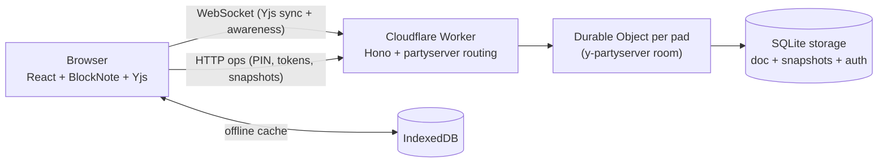

# Padline

**URL-first, no-account, real-time collaborative pads.** A modern [Dontpad](http://dontpad.com) successor.

[](LICENSE)
[](https://workers.cloudflare.com/)
[](CONTRIBUTING.md)

**Live at [padline.page](https://padline.page)** — open any URL and start typing.

Open a URL → it's a pad. Share the link → you're collaborating. A pad is a lightweight Notion-style page with live cursors, presence, offline resilience, and snapshot history. No accounts, no onboarding, no friction.

## Features

- ✏️ **Rich collaborative editing** — Notion-style blocks (BlockNote) over Yjs CRDTs; simultaneous edits merge conflict-free
- 👥 **Presence** — live cursors, selections, and auto-generated identities ("Mellow Otter") you can rename
- 🔗 **URL-first** — `padline.page/anything-you-like` *is* the pad; empty pads cost nothing until the first keystroke
- 🔒 **PIN protection** — optional per-pad PIN gates both viewing and editing, enforced server-side with brute-force backoff
- 👁️ **Read-only links** — share a view-only capability URL; rotate it anytime to revoke old copies
- 🕘 **Snapshot history** — automatic snapshots on idle; restoring is itself an undoable edit, never a rollback
- 📴 **Offline resilience** — every visited pad is cached in IndexedDB; brief disconnections lose nothing
- 📤 **Markdown export** — copy or download; your content is never trapped
- 🛡️ **Abuse invariants** — document size caps, connection caps, message limits, per-IP caps ([ADR-0008](docs/adr/0008-abuse-invariants-only-in-v1.md), [ADR-0009](docs/adr/0009-brute-force-and-token-lifetime-hardening.md))

## How it works

The whole app is **one Cloudflare Worker**: static assets, HTTP API, and one Durable Object room per pad.



- A **pad** is identified by its slug — the URL path. One pad ↔ one Durable Object room holding live connections, the Yjs document, snapshot history, and the PIN/read-only gates.
- Authorization happens **before any document bytes are sent**: PIN-protected pads refuse the WebSocket until a valid session token is presented; read-only links connect with a capability token the room enforces.
- Documents persist to SQLite-backed Durable Object storage; snapshots are taken on an idle trigger and capped at 100 per pad.
- Cloudflare serves content-hashed JS/CSS directly from its static asset edge cache; document routes still run through the Worker for crawler metadata and dynamic security headers.
- The landing, legal, and editor routes load independently, so opening the homepage does not download the BlockNote collaboration graph.

**Stack**: React 19 · Vite · Tailwind v4 · shadcn/ui · BlockNote · Yjs · y-indexeddb · Hono · Cloudflare Workers · Durable Objects (SQLite) · y-partyserver

See [`CONTEXT.md`](CONTEXT.md) for the domain model and ubiquitous language, and [`docs/adr/`](docs/adr/) for why each decision was made.

## Quickstart

```sh
git clone https://github.com/idcesares/padline.git
cd padline
npm install
npm run dev      # http://127.0.0.1:8788 — Vite + the Worker running locally
npm test         # room integration tests inside the Cloudflare Workers runtime
```

Open `http://127.0.0.1:8788/my-first-pad` and start typing. Open the same URL in a second tab to see collaboration live.

> **Windows note**: the dev server is pinned to `127.0.0.1:8788` because Windows reserves the 5142–5241 port range. `.npmrc` sets `legacy-peer-deps` to reconcile a peer-dependency mismatch between `partyserver` and `wrangler`.

## Deploy your own

Padline runs entirely on the Cloudflare free tier — one command deploys everything:

```sh
npx wrangler login   # once
npm run deploy       # build + deploy Worker, assets, and Durable Objects
```

Your instance is live at `https://padline.<your-subdomain>.workers.dev`. To use a custom domain, edit the `routes` block in [`wrangler.jsonc`](wrangler.jsonc).

**Recommended**: add a per-IP rate-limiting rule in the Cloudflare dashboard (Security → WAF → Rate limiting) as the outer layer against PIN brute-forcing — the app enforces per-pad backoff on its own, but defense in depth is cheap.

### Moderation (takedowns)

Operating a public instance means being able to act on content reports — the published [Content Policy](https://padline.page/content-policy) and [Privacy Policy](https://padline.page/privacy) both promise it. There's no dashboard and no pad registry by design (see [ADR-0010](docs/adr/0010-reactive-takedown-admin-ops.md)) — reports arrive by email with a URL, and you act on that one slug.

**One-time setup**, before you need it:

```sh
npx wrangler secret put ADMIN_SECRET   # paste a long random value; store it in a password manager
npm run deploy
```

Until this is done, the admin surface doesn't exist on your instance — every `admin-*` request answers exactly like an unknown op.

**When a report email arrives** (content policy violation, or a privacy removal request), the slug is in the URL the reporter gave you:

```sh
# 1. Inspect — works even if the pad has a PIN, so a PIN can't block enforcement
ADMIN_SECRET=... node scripts/admin.mjs <host> <slug> info

# 2. Act, based on what you saw:
ADMIN_SECRET=... node scripts/admin.mjs <host> <slug> purge --block --reason "content policy: <why>"
#   ^ policy violation: wipe content + snapshots AND block the slug so it can't be refilled
ADMIN_SECRET=... node scripts/admin.mjs <host> <slug> purge --reason "removal request"
#   ^ privacy removal request: wipe content + snapshots, leave the slug free to reuse

# 3. Reply to the reporter confirming action was taken.
```

`unblock` reverses a block if it was applied in error. `<host>` is your domain (e.g. `padline.page`) or `127.0.0.1:8791` locally.

**Note:** the Content Policy and Privacy Policy both route reports to the same inbox as [SECURITY.md](SECURITY.md)'s vulnerability reports — triage by content: a bug/exploit goes through SECURITY.md's process, a bad pad goes through this one.

## Scripts

| Command | What it does |
| --- | --- |
| `npm run dev` | Vite dev server with the Worker running locally |
| `npm test` | Cloudflare Workers integration tests (HTTP, WebSocket limits, SQLite-backed room eviction) |
| `npm run build` | Typecheck + production build |
| `npm run deploy` | Build + `wrangler deploy` |
| `node scripts/api-smoke.mjs` | Smoke suite against the local dev server (set `ADMIN_SECRET` to also exercise the takedown lifecycle) |
| `node scripts/api-smoke.mjs https://your-host` | Same suite against a deployed instance |
| `node scripts/admin.mjs <host> <slug> <action>` | Moderation CLI: `info` / `block` / `unblock` / `purge` |

## Project structure

```
├── src/                  # React SPA
│   ├── routes/           #   landing + pad pages
│   ├── components/       #   presence, share dialog, history, UI primitives
│   ├── hooks/            #   theme, awareness
│   └── lib/              #   slug rules, pad HTTP API, identity
├── worker/               # Cloudflare Worker: routing, OG tags, PadRoom Durable Object
├── test/                 # Workers-runtime integration tests for the room interface
├── scripts/              # smoke tests (HTTP + WebSocket)
├── docs/
│   ├── adr/              # architecture decision records (the "why")
│   └── agents/           # conventions for AI-assisted development
├── CONTEXT.md            # domain model & ubiquitous language
└── wrangler.jsonc        # Cloudflare deployment config
```

The test suite uses Cloudflare's Vitest pool, so Durable Objects, SQLite storage,
and WebSockets run locally in `workerd` instead of browser or Node mocks. See
[ADR-0011](docs/adr/0011-cloudflare-native-delivery-and-tests.md) for the asset
routing and verification decision.

## Contributing

Contributions are welcome — see [CONTRIBUTING.md](CONTRIBUTING.md) for setup, conventions (ADRs, smoke tests), and the PR flow. Security issues: see [SECURITY.md](SECURITY.md).

## Policies

The deployed service publishes its [Terms of Use](https://padline.page/terms), [Privacy Policy](https://padline.page/privacy), and [Content Policy](https://padline.page/content-policy) — plain-language pages served by the app itself (`src/routes/legal.tsx`). If you self-host, adapt them to your own deployment.

## SEO & discoverability

`public/robots.txt`, `public/sitemap.xml`, and `public/llms.txt` document the
crawling and AI-assistant-citation policy — see
[ADR-0012](docs/adr/0012-seo-and-geo.md) for the reasoning.

## License & author

[MIT](LICENSE) © [Isaac D'Césares](https://github.com/idcesares)
