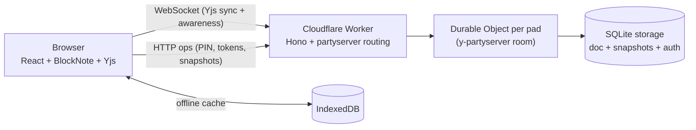

# Padline

**URL-first, no-account, real-time collaborative pads.** A modern [Dontpad](http://dontpad.com) successor.

[](LICENSE)
[](https://workers.cloudflare.com/)
[](CONTRIBUTING.md)

**Live at [padline.page](https://padline.page)** — open any URL and start typing.

Open a URL → it's a pad. Share the link → you're collaborating. A pad is a lightweight Notion-style page with live cursors, presence, offline resilience, and snapshot history. No accounts, no onboarding, no friction.

## Features

- ✏️ **Rich collaborative editing** — Notion-style blocks (BlockNote) over Yjs CRDTs; simultaneous edits merge conflict-free
- 👥 **Presence** — live cursors, selections, and auto-generated identities ("Mellow Otter") you can rename
- 🔗 **URL-first** — `padline.page/anything-you-like` *is* the pad; empty pads cost nothing until the first keystroke
- 🔒 **PIN protection** — optional per-pad PIN gates both viewing and editing, enforced server-side with brute-force backoff
- 👁️ **Read-only links** — share a view-only capability URL; rotate it anytime to revoke old copies
- 🕘 **Snapshot history** — automatic snapshots on idle; restoring is itself an undoable edit, never a rollback
- 📴 **Offline resilience** — every visited pad is cached in IndexedDB; brief disconnections lose nothing
- 📊 **Status line** — live word, character, block, and reading-time counts beside a labelled sync indicator; dockable and toggleable per visitor
- 📤 **Markdown export** — copy or download; your content is never trapped
- 🛡️ **Abuse invariants** — document size caps, connection caps, message limits, per-IP caps ([ADR-0008](docs/adr/0008-abuse-invariants-only-in-v1.md), [ADR-0009](docs/adr/0009-brute-force-and-token-lifetime-hardening.md))

## How it works

The whole app is **one Cloudflare Worker**: static assets, HTTP API, and one Durable Object room per pad.


```mermaid
flowchart LR
    B[Browser<br/>React + BlockNote + Yjs] -->|"WebSocket (Yjs sync + awareness)"| W[Cloudflare Worker<br/>Hono + partyserver routing]
    B -->|"HTTP ops (PIN, tokens, snapshots)"| W
    W --> DO["Durable Object per pad<br/>(y-partyserver room)"]
    DO --> S[("SQLite storage<br/>doc + snapshots + auth")]
    B <-->|offline cache| IDB[(IndexedDB)]
```

- A **pad** is identified by its slug — the URL path. One pad ↔ one Durable Object room holding live connections, the Yjs document, snapshot history, and the PIN/read-only gates.
- Authorization happens **before any document bytes are sent**: PIN-protected pads refuse the WebSocket until a valid session token is presented; read-only links connect with a capability token the room enforces.
- Documents persist to SQLite-backed Durable Object storage; snapshots are taken on an idle trigger and capped at 100 per pad.
- The Worker is **six modules with one owner each**: WebSocket admission, connection and per-IP caps, and routing (`worker/index.ts`); the HTTP capability surface and takedown precedence (`room-capabilities.ts`); every access credential — PIN, sessions, brute-force backoff, read-only tokens (`room-security.ts`); document durability, snapshots, and the size-cap freeze (`room-persistence.ts`); the operator's secret, shared by the room and the ledger (`admin-auth.ts`); and the moderation ledger that records every notice, review, and takedown (`moderation-ledger.ts`, [ADR-0018](docs/adr/0018-notice-and-action-moderation.md)). See [ADR-0015](docs/adr/0015-room-capability-and-access-security-modules.md) and [ADR-0016](docs/adr/0016-room-security-owns-access-credentials.md).
- Cloudflare serves content-hashed JS/CSS directly from its static asset edge cache; document routes still run through the Worker for crawler metadata and dynamic security headers.
- The landing, legal, and editor routes load independently, so opening the homepage does not download the BlockNote collaboration graph.

**Stack**: React 19 · Vite · Tailwind v4 · shadcn/ui · BlockNote · Yjs · y-indexeddb · Hono · Cloudflare Workers · Durable Objects (SQLite) · y-partyserver

See [`CONTEXT.md`](CONTEXT.md) for the domain model and ubiquitous language, and [`docs/adr/`](docs/adr/) for why each decision was made.

## Quickstart

```sh
git clone https://github.com/idcesares/padline.git
cd padline
npm install
npx playwright install chromium   # for the browser tests
npm run dev        # http://127.0.0.1:8788 — Vite + the Worker running locally
npm test           # room integration tests inside the Cloudflare Workers runtime
npm run test:e2e   # pad-session tests in a real browser
```

Open `http://127.0.0.1:8788/my-first-pad` and start typing. Open the same URL in a second tab to see collaboration live.

> **Windows note**: the dev server is pinned to `127.0.0.1:8788` because Windows reserves the 5142–5241 port range. `.npmrc` sets `legacy-peer-deps` to reconcile a peer-dependency mismatch between `partyserver` and `wrangler`.

## Deploy your own

Padline runs entirely on the Cloudflare free tier — one command deploys everything:

```sh
npx wrangler login   # once
npm run deploy       # build + deploy Worker, assets, and Durable Objects
```

Your instance is live at `https://padline.<your-subdomain>.workers.dev`. To use a custom domain, edit the `routes` block in [`wrangler.jsonc`](wrangler.jsonc).

**Recommended**: add a per-IP rate-limiting rule in the Cloudflare dashboard (Security → WAF → Rate limiting) as the outer layer against PIN brute-forcing — the app enforces per-pad backoff on its own, but defense in depth is cheap.

### Moderation (takedowns)

Operating a public instance means being able to act on content reports — the published [Content Policy](https://padline.page/content-policy) and [Privacy Policy](https://padline.page/privacy) both promise it. There's no dashboard and no pad registry by design (see [ADR-0010](docs/adr/0010-reactive-takedown-admin-ops.md)). Every notice becomes a **case** in the moderation ledger, and every review and takedown goes through it and is recorded in a hash-chained action log ([ADR-0018](docs/adr/0018-notice-and-action-moderation.md)) — the room's own admin operations are not reachable from outside.

**The legal responsibility for a public instance is yours.** `padline.page` is operated by an individual in Brazil, and its policies and planned moderation design ([ADR-0018](docs/adr/0018-notice-and-action-moderation.md)) were written for Brazilian law. Before opening a fork to the public, read [Operating a public instance](docs/operating-a-public-instance.md) — it lists what is Brazil-specific and what to redo for your jurisdiction.

**One-time setup**, before you need it:

```sh
npx wrangler secret put ADMIN_SECRET       # paste a long random value; store it in a password manager
npx wrangler secret put TURNSTILE_SECRET   # from a Turnstile widget created for your domain
npm run deploy
```

Until this is done, the admin surface doesn't exist on your instance — every admin request answers exactly like an unknown op — and public reports to `/api/reports` are refused with `503`. Add a Cloudflare rate-limiting rule on `/api/reports` as the outer layer; Turnstile is verified server-side before anything is stored.

**When a report arrives** (content policy violation, or a privacy removal request), the slug is in the URL the reporter gave you. The CLI reads `ADMIN_SECRET` from the environment or `.dev.vars`:

```sh
# 1. Record the notice — a later notice on the same slug attaches to the open case
node scripts/admin.mjs <host> case open <slug> --category phishing-malware --source email --note "<what the reporter said>"
#   (a removal request: --kind removal-request --category privacy)

# 2. Review — works even if the pad has a PIN, so a PIN can't block enforcement
node scripts/admin.mjs <host> case <id> review

# 3. Act, with a reason (required) and optionally the legal basis:
node scripts/admin.mjs <host> case <id> purge --block --reason "<why>" --legal-basis "Content Policy: <rule>"
#   ^ policy violation: wipe content + snapshots AND block the slug so it can't be refilled
node scripts/admin.mjs <host> case <id> purge --reason "removal request"
#   ^ privacy removal request: wipe content + snapshots, leave the slug free to reuse
node scripts/admin.mjs <host> case <id> dismiss --reason "<why this is not a violation>"

# 4. Reply to the reporter, then close the case.
node scripts/admin.mjs <host> case <id> close --reason "reporter informed"
```

`node scripts/admin.mjs <host> cases --status open` lists open cases, grave first; `case <id>` shows a case's notices and actions; `unblock --reason` reverses a block applied in error; `verify-chain` checks the action log; `reconcile` resolves an action interrupted between the room and the ledger. `<host>` is your domain (e.g. `padline.page`) or `127.0.0.1:8788` locally.

**Note:** the Content Policy and Privacy Policy both route reports to the same inbox as [SECURITY.md](SECURITY.md)'s vulnerability reports — triage by content: a bug/exploit goes through SECURITY.md's process, a bad pad goes through this one.

## Scripts

| Command | What it does |
| --- | --- |
| `npm run dev` | Vite dev server with the Worker running locally |
| `npm test` | Cloudflare Workers integration tests (HTTP, WebSocket limits, SQLite-backed room eviction) |
| `npm run test:e2e` | Playwright pad-session tests in real Chromium against the local Worker |
| `npm run build` | Typecheck + production build |
| `npm run deploy` | Build + `wrangler deploy` |
| `node scripts/api-smoke.mjs` | Smoke suite against the local dev server, takedown lifecycle included — it reads `ADMIN_SECRET` from the environment or `.dev.vars`, and fails if it finds neither |
| `node scripts/api-smoke.mjs --no-admin` | Same suite with the takedown lifecycle deliberately skipped |
| `node scripts/api-smoke.mjs https://your-host` | Same suite against a deployed instance |
| `node scripts/admin.mjs <host> <command>` | Moderation CLI over the ledger: `cases`, `case open`, `case <id> review\|block\|unblock\|purge\|dismiss\|close`, `pad <slug> info`, `reconcile`, `verify-chain` |

## Project structure

```
├── src/                        # React SPA
│   ├── routes/                 #   landing, pad session, legal pages
│   ├── components/             #   presence, share dialog, history, status line, UI primitives
│   ├── hooks/                  #   theme, awareness, pad stats, status-line preference
│   └── lib/                    #   slug rules, pad HTTP API, identity, moderation profile
├── worker/                     # Cloudflare Worker — one owner per module:
│   ├── index.ts                #   WebSocket admission, connection + per-IP caps, routing
│   ├── room-capabilities.ts    #   HTTP capability surface, takedown precedence
│   ├── room-security.ts        #   PIN, sessions, backoff, read-only tokens
│   ├── room-persistence.ts     #   document durability, snapshots, size-cap freeze
│   ├── admin-auth.ts           #   the operator's secret, shared by room and ledger
│   └── moderation-ledger.ts    #   notices, cases, and the recorded takedown path
├── test/                       # Workers-runtime integration tests for the room interface
├── e2e/                        # Playwright pad-session tests through the public pad URL
├── scripts/                    # smoke suite (HTTP + WebSocket) + the moderation CLI
├── docs/
│   ├── adr/                    # architecture decision records (the "why")
│   └── agents/                 # conventions for AI-assisted development
├── CONTEXT.md                  # domain model & ubiquitous language
└── wrangler.jsonc              # Cloudflare deployment config
```

The test suite uses Cloudflare's Vitest pool, so Durable Objects, SQLite storage,
and WebSockets run locally in `workerd` instead of browser or Node mocks. See
[ADR-0011](docs/adr/0011-cloudflare-native-delivery-and-tests.md) for the asset
routing and verification decision. Browser-side pad-session behavior runs in
real Chromium through Playwright against that same local Worker, rather than in
a DOM simulator — see
[ADR-0013](docs/adr/0013-route-owned-pad-session.md).

## Contributing

Contributions are welcome — see [CONTRIBUTING.md](CONTRIBUTING.md) for setup, conventions (ADRs, smoke tests), and the PR flow. Security issues: see [SECURITY.md](SECURITY.md).

## Policies

The deployed service publishes its [Terms of Use](https://padline.page/terms), [Privacy Policy](https://padline.page/privacy), and [Content Policy](https://padline.page/content-policy) — plain-language pages served by the app itself (`src/routes/legal.tsx`). They are written for `padline.page`'s operator under Brazilian law; if you self-host, rewrite them for your own deployment and jurisdiction — see [Operating a public instance](docs/operating-a-public-instance.md).

## SEO & discoverability

`public/robots.txt`, `public/sitemap.xml`, and `public/llms.txt` document the
crawling and AI-assistant-citation policy — see
[ADR-0012](docs/adr/0012-seo-and-geo.md) for the reasoning.

## How this is built

Padline is written by AI coding agents under human product direction. Product
decisions, architecture, and trade-offs are human-owned and human-reviewed; the
agents do implementation, refactoring, and test coverage against specs written
for them.

That split is auditable rather than asserted. [`docs/adr/`](docs/adr/) carries a
numbered ADR for every non-obvious decision — what was chosen, what was
*rejected*, and why — and [`AGENTS.md`](AGENTS.md) is the working contract the
agents follow.

**This describes how the software is written, not how it runs.** Padline ships
no AI features and makes no model calls. Pad content stays between your browser
and its Room and is never sent to a model — AI features are explicitly deferred
(see [`CONTEXT.md`](CONTEXT.md)).

## License & author

[MIT](LICENSE) © [Isaac D'Césares](https://github.com/idcesares) — created and
directed by a human, implemented with AI assistance.
