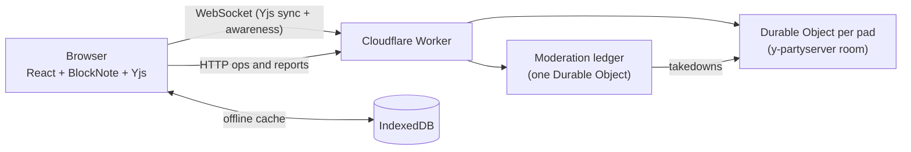

# Padline

**URL-first, no-account, real-time collaborative pads.** A modern [Dontpad](http://dontpad.com) successor.

[](LICENSE)
[](https://workers.cloudflare.com/)
[](CONTRIBUTING.md)

**Live at [padline.page](https://padline.page)** — open any URL and start typing.

Open a URL → it's a pad. Share the link → you're collaborating. A pad is a lightweight Notion-style page with live cursors, presence, offline resilience, and snapshot history. No accounts, no onboarding, no friction.

## Features

- ✏️ **Rich collaborative editing** — Notion-style blocks (BlockNote) over Yjs CRDTs; simultaneous edits merge conflict-free
- 👥 **Presence** — live cursors, selections, and auto-generated identities ("Mellow Otter") you can rename
- 🔗 **URL-first** — `padline.page/anything-you-like` *is* the pad; empty pads cost nothing until the first keystroke
- 🔒 **PIN protection** — optional per-pad PIN gates both viewing and editing, enforced server-side with brute-force backoff
- 👁️ **Read-only links** — share a view-only capability URL; rotate it anytime to revoke old copies
- 🕘 **Snapshot history** — automatic snapshots; restoring is itself an undoable edit, never a rollback
- 📴 **Offline resilience** — every visited pad is cached in IndexedDB; brief disconnections lose nothing
- 📊 **Status line** — live word, character, block, and reading-time counts beside a labelled sync indicator
- 📤 **Markdown export** — copy or download; your content is never trapped
- 🚩 **Reporting & moderation** — a Turnstile-gated report form, cases, evidence with retention, freeze/block/remove, totals and exports, all in a tamper-evident log ([ADR-0018](docs/adr/0018-notice-and-action-moderation.md))
- 🛡️ **Abuse invariants** — document size caps, connection caps, message limits, per-IP caps ([ADR-0008](docs/adr/0008-abuse-invariants-only-in-v1.md), [ADR-0009](docs/adr/0009-brute-force-and-token-lifetime-hardening.md))

## Documentation

| | |
| --- | --- |
| **[User guide](docs/user-guide.md)** | Using pads: sharing, PINs, read-only links, history, export, limits, reporting |
| **[Self-hosting](docs/self-hosting.md)** | Local dev, deploying, secrets, edge rules, upgrades, troubleshooting |
| **[Operating a public instance](docs/operating-a-public-instance.md)** | Your legal responsibility, and what's specific to Brazil |
| **[Moderation guide](docs/moderation-guide.md)** | Handling reports end to end, evidence, totals, exports |
| **Reference** | [CLI](docs/reference/cli.md) · [HTTP & WebSocket API](docs/reference/http-api.md) · [Configuration & limits](docs/reference/configuration.md) |
| **[Architecture](docs/architecture.md)** | Modules, flows, storage, security boundaries, tests |
| **[ADRs](docs/adr/)** · **[CONTEXT.md](CONTEXT.md)** | Why each decision was made · the domain vocabulary |

All of it is indexed in [`docs/`](docs/README.md).

## How it works

The whole app is **one Cloudflare Worker**: static assets, an HTTP API, one Durable Object room per pad, and one moderation ledger.


```mermaid
flowchart LR
    B[Browser<br/>React + BlockNote + Yjs] -->|"WebSocket (Yjs sync + awareness)"| W[Cloudflare Worker]
    B -->|"HTTP ops and reports"| W
    W --> DO["Durable Object per pad<br/>(y-partyserver room)"]
    W --> L["Moderation ledger<br/>(one Durable Object)"]
    L -->|takedowns| DO
    B <-->|offline cache| IDB[(IndexedDB)]
```

Authorization happens **before any document bytes are sent**, every takedown goes through the ledger and is recorded, and there is no list of pads by design. The [architecture page](docs/architecture.md) walks through each flow.

**Stack**: React 19 · Vite · Tailwind v4 · shadcn/ui · BlockNote · Yjs · y-indexeddb · Hono · Cloudflare Workers · Durable Objects (SQLite) · y-partyserver · Turnstile

## Quickstart

```sh
git clone https://github.com/idcesares/padline.git
cd padline
npm install
npm run dev        # http://127.0.0.1:8788
```

Open `http://127.0.0.1:8788/my-first-pad` in two tabs and type in one. For local secrets, tests, and the Windows notes, see [Self-hosting](docs/self-hosting.md#run-it-locally).

## Deploy your own

```sh
npx wrangler login
npm run deploy
```

Padline runs on the Cloudflare free tier. Before opening an instance to the public, point `wrangler.jsonc` at your own domain, set the moderation secrets, and read [Operating a public instance](docs/operating-a-public-instance.md) — **the legal responsibility is yours**, and this repository's policies were written for `padline.page`'s operator under Brazilian law. The full checklist is in [Self-hosting](docs/self-hosting.md).

## Contributing

Contributions are welcome — see [CONTRIBUTING.md](CONTRIBUTING.md) for setup, verification, and the PR flow. Security issues: see [SECURITY.md](SECURITY.md). A report about a pad's *content* is a moderation matter, not a vulnerability — use the [report form](https://padline.page/report).

## Policies

The deployed service publishes its [Terms of Use](https://padline.page/terms), [Privacy Policy](https://padline.page/privacy), and [Content Policy](https://padline.page/content-policy), served by the app itself (`src/routes/legal.tsx`). If you self-host, rewrite them for your own deployment and jurisdiction.

## SEO & discoverability

`public/robots.txt`, `public/sitemap.xml`, and `public/llms.txt` document the crawling and AI-assistant-citation policy — see [ADR-0012](docs/adr/0012-seo-and-geo.md).

## How this is built

Padline is written by AI coding agents under human product direction. Product
decisions, architecture, and trade-offs are human-owned and human-reviewed; the
agents do implementation, refactoring, and test coverage against specs written
for them.

That split is auditable rather than asserted. [`docs/adr/`](docs/adr/) carries a
numbered ADR for every non-obvious decision — what was chosen, what was
*rejected*, and why — and [`AGENTS.md`](AGENTS.md) is the working contract the
agents follow.

**This describes how the software is written, not how it runs.** Padline ships
no AI features and makes no model calls. Pad content stays between your browser
and its Room and is never sent to a model — AI features are explicitly deferred
(see [`CONTEXT.md`](CONTEXT.md)).

## License & author

[MIT](LICENSE) © [Isaac D'Césares](https://github.com/idcesares) — created and
directed by a human, implemented with AI assistance.
