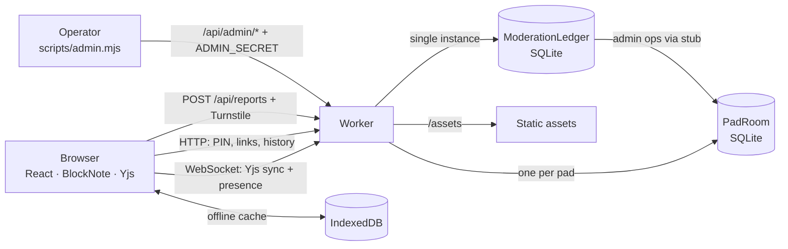
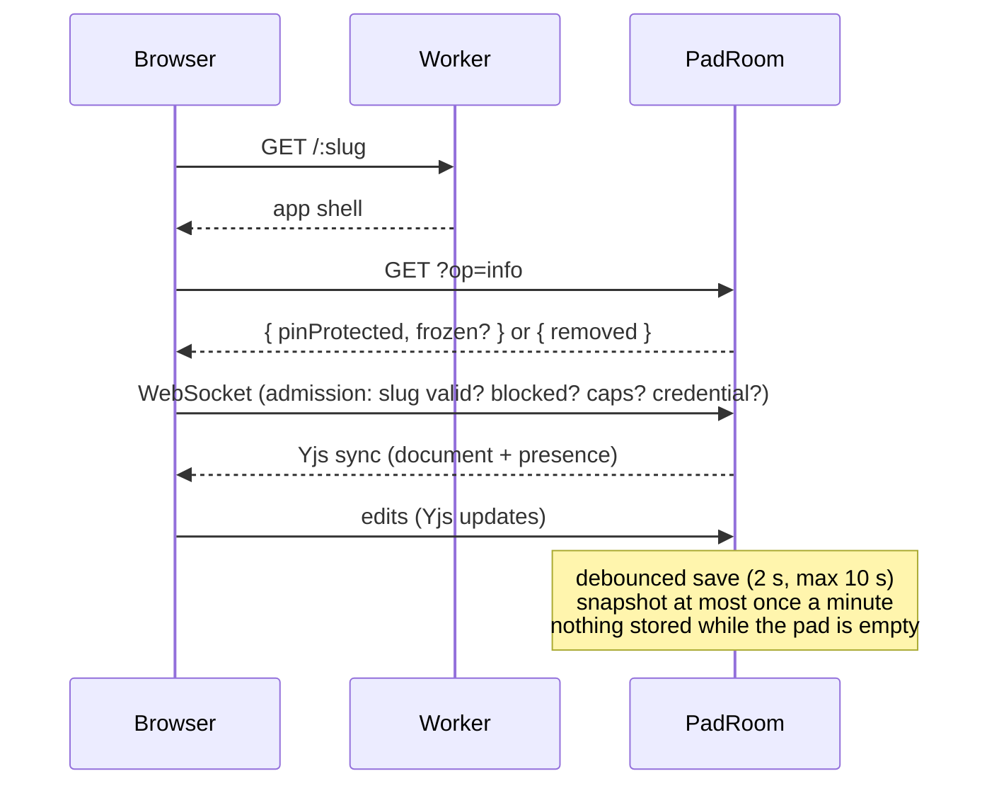
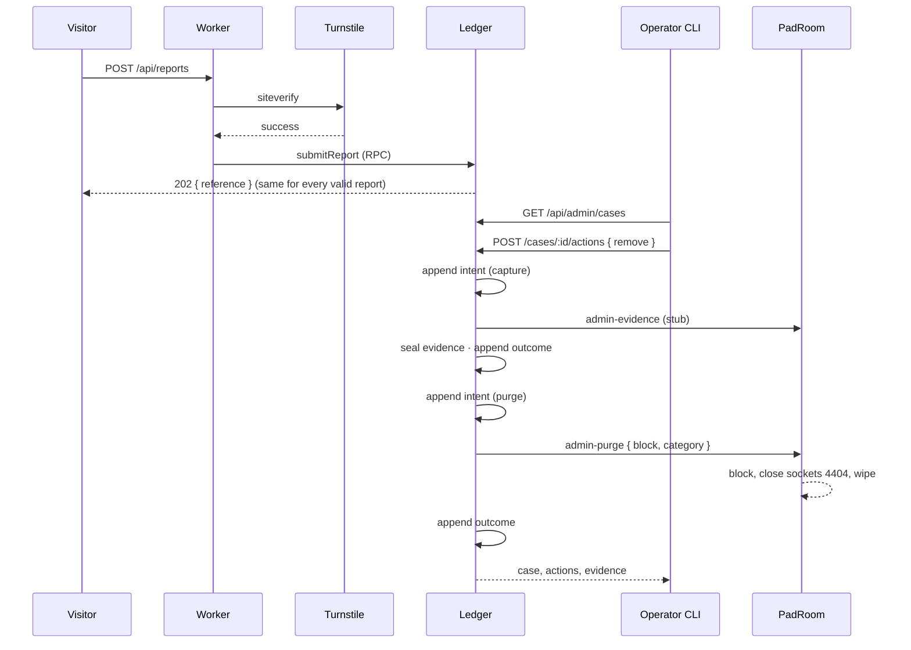

# Architecture

How Padline fits together, end to end. For *why* each piece is the way it is,
follow the ADR links; for exact names and codes, see the
[reference](README.md).

- [The big picture](#the-big-picture)
- [Worker modules](#worker-modules)
- [Flow: opening and editing a pad](#flow-opening-and-editing-a-pad)
- [Flow: a PIN-protected pad](#flow-a-pin-protected-pad)
- [Flow: a report becomes a takedown](#flow-a-report-becomes-a-takedown)
- [Where data lives](#where-data-lives)
- [Security boundaries](#security-boundaries)
- [Front end](#front-end)
- [How it's tested](#how-its-tested)
- [Project structure](#project-structure)

## The big picture

The whole product is **one Cloudflare Worker** with two kinds of Durable Object
([ADR-0003](adr/0003-selfhosted-durable-objects-y-partyserver.md),
[ADR-0011](adr/0011-cloudflare-native-delivery-and-tests.md)).



- **A pad is a room.** Visiting `/:slug` loads the app, which opens a WebSocket
  to that pad's `PadRoom`. One pad ↔ one room ↔ one Durable Object.
- **The ledger is the operator's side.** Reports, cases, evidence, and the action
  log live in a single `ModerationLedger`. It is the **only** caller of a room's
  admin operations ([ADR-0018](adr/0018-notice-and-action-moderation.md)).
- **There is no list of pads.** Durable Objects can't be enumerated, and no index
  is kept on purpose ([ADR-0010](adr/0010-reactive-takedown-admin-ops.md)).

## Worker modules

Each module has one owner and one reason to change
([ADR-0015](adr/0015-room-capability-and-access-security-modules.md),
[ADR-0016](adr/0016-room-security-owns-access-credentials.md)).

| Module | Owns |
| --- | --- |
| `worker/index.ts` | Routing (assets, `/api`, `/parties`, crawlers, canonical host), security headers, WebSocket admission, connection and message caps, refusing public `op=admin-*`. |
| `worker/room-capabilities.ts` | A room's HTTP operations and their precedence: admin concealment → block → ordinary ops. The `blocked` and `frozen` records and the public statement of reasons. |
| `worker/room-security.ts` | Every access credential: PIN hashing, sessions, backoff, read-only tokens. |
| `worker/room-persistence.ts` | The document, snapshots, the size-cap freeze, purge, and evidence reads ([ADR-0014](adr/0014-room-owns-persisted-pad-state.md)). |
| `worker/admin-auth.ts` | The constant-time `ADMIN_SECRET` check, shared by room and ledger. |
| `worker/moderation-ledger.ts` | Reports, cases, the hash-chained action log, evidence and retention, stats, exports; orchestrates room admin ops. |
| `worker/turnstile.ts` | Server-side Turnstile verification. |
| `worker/bytes.ts` | Base64 and SHA-256 helpers for evidence. |
| `src/lib/moderation-profile.ts` | Jurisdiction-specific moderation values, shared by Worker and app. |
| `src/lib/slug.ts` | Slug rules, shared by Worker and app. |

## Flow: opening and editing a pad



- The browser renders from its IndexedDB copy immediately, then merges with the
  room ([ADR-0013](adr/0013-route-owned-pad-session.md)).
- Restoring a snapshot replaces the document **as a new edit**
  ([ADR-0006](adr/0006-snapshot-history.md)).
- Over 2 MB, the room stops persisting and refuses edits from every connection.

## Flow: a PIN-protected pad

1. `info` says `pinProtected: true`; the app shows the PIN prompt (or uses a stored
   session).
2. `verify-pin` checks the PIN against its salted PBKDF2 hash, applies backoff, and
   returns a session token ([ADR-0005](adr/0005-pin-gates-everything-readonly-links.md),
   [ADR-0009](adr/0009-brute-force-and-token-lifetime-hardening.md)).
3. The WebSocket connects with `?token=`; without a valid one the room closes
   `4401` **before sending any document bytes**.
4. A read-only link connects with `?ro=` instead; the room marks that connection
   read-only and drops its writes.

## Flow: a report becomes a takedown



- The public `/parties` route refuses every `admin-*` op, so a takedown **can only**
  happen through this path.
- If the ledger is interrupted between intent and outcome, `reconcile` asks the
  room what's true and records it.
- The block lives in the room's storage. The ledger never answers "is this pad
  blocked?" on its own.

## Where data lives

**`PadRoom` (one per pad)**

| Key / table | Holds |
| --- | --- |
| `doc` | The Yjs document (≤ 2 MB) |
| `snapshots` table | `id, created_at, size, data` — newest 100 |
| `lastSnapshotAt`, `docOverCap` | Snapshot cadence; the size-cap freeze marker |
| `pin`, `sessions`, `pinFails`, `roToken` | Salted PIN hash, session grant times, backoff counter, read-only token |
| `blocked`, `frozen` | Enforcement records `{ at, reason?, category? }` |

**`ModerationLedger` (one instance)**

| Table | Holds |
| --- | --- |
| `cases` | One per pad and kind while open: status, priority, timestamps, decision, legal basis |
| `reports` | Every notice: reference, category, description, contact (cleared after retention), source |
| `actions` | Append-only, hash-chained log; never updated or deleted |
| `evidence` | Capture records: sizes, SHA-256s, pad state, retention, hold |
| `evidence_chunks` | Document and text bytes in 1 MB chunks, deleted at expiry |

**Browser** — identity, theme, status-line preference, PIN sessions
(localStorage), and an offline copy of each visited pad (IndexedDB).

Nothing stores IP addresses. The Worker reads the connecting IP only to enforce
the per-IP connection cap and to forward it to Turnstile.

## Security boundaries

| Boundary | Enforced by |
| --- | --- |
| No document bytes before authorization | WebSocket admission in `PadRoom.onConnect`; `info` is the only pre-auth op. |
| Read-only really means read-only | `PadRoom.isReadOnly` on every message. |
| PINs can't be read or brute-forced cheaply | PBKDF2 (100,000 iterations), per-pad backoff, edge rate limits. |
| The operator can always enforce | Admin ops read through PINs; purge clears every credential. |
| Admin surface invisible without the secret | Constant-time compare; every failure answers `unknown-op`. |
| No unrecorded takedown | Public route refuses `admin-*`; the ledger records intent before calling the room. |
| Tampering is detectable | SHA-256 hash chain over the action log; `verify-chain`. |
| Reports can't probe pads or flood storage | Turnstile first; identical `202` for every valid report; edge rate limits. |
| Browser hardening | CSP (only Turnstile as a third-party origin), HSTS, `nosniff`, `no-referrer`, `frame-ancestors 'none'`. |

Accepted trade-offs are listed in [SECURITY.md](../SECURITY.md).

## Front end

- **React 19 SPA** with React Router; landing, pad, policy, and report pages load
  as separate chunks ([ADR-0001](adr/0001-react-spa-with-shadcn.md)).
- **BlockNote** editor over Yjs; image, file, video, and audio blocks are disabled
  ([ADR-0002](adr/0002-blocknote-editor.md), [ADR-0007](adr/0007-defer-images-with-moderation-kit.md)).
- **`src/routes/pad-session.tsx`** owns one pad visit: access resolution (PIN,
  removed, frozen), the provider, offline cache, and the editor
  ([ADR-0013](adr/0013-route-owned-pad-session.md)).
- **Design system:** Tailwind v4 + shadcn/ui; the editor surface uses the same
  tokens ([ADR-0017](adr/0017-editor-surface-owns-its-design-tokens.md)).

## How it's tested

| Layer | Command | What it proves |
| --- | --- | --- |
| Workers runtime | `npm test` | Rooms and the ledger in real `workerd`: HTTP, WebSockets, SQLite, eviction, alarms. Turnstile is answered by Miniflare's outbound service. |
| Browser | `npm run test:e2e` | Pad sessions, PINs, read-only links, offline cache, freeze and removal screens, and the report form, in real Chromium. |
| Smoke | `node scripts/api-smoke.mjs [host]` | A running or deployed instance end to end, including the takedown lifecycle. |

See [CONTRIBUTING.md](../CONTRIBUTING.md) for what a change must pass.

## Project structure

```
├── src/                        # React app
│   ├── routes/                 #   landing, pad, pad session, policy pages, report form
│   ├── components/             #   presence, share dialog, history, status line, pad menu, UI primitives
│   ├── hooks/                  #   theme, awareness, pad stats, status-line preference
│   └── lib/                    #   slug rules, pad API, report API, identity, moderation profile and labels
├── worker/                     # Cloudflare Worker (see "Worker modules")
├── test/                       # Workers-runtime tests (room, ledger, reports)
├── e2e/                        # Playwright browser tests
├── scripts/
│   ├── admin.mjs               #   moderation CLI
│   ├── api-smoke.mjs           #   end-to-end smoke suite
│   └── ws-smoke.mjs            #   WebSocket smoke check
├── public/                     # robots.txt, sitemap.xml, llms.txt, headers
├── docs/                       # this documentation, ADRs, agent conventions
├── CONTEXT.md                  # domain vocabulary
└── wrangler.jsonc              # Cloudflare config
```
