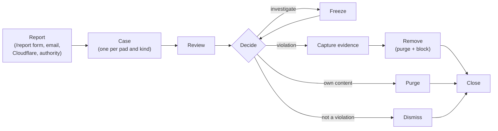

# Moderation guide

How to handle reports on your instance from the first notice to a closed case —
and how to prove afterwards that you did.

This page covers the **mechanics**. What your law requires, and where to refer
criminal content, depends on your jurisdiction: see
[Operating a public instance](operating-a-public-instance.md). Every command is
listed with all its flags in the [CLI reference](reference/cli.md).

- [How moderation works](#how-moderation-works)
- [Before you start](#before-you-start)
- [Your daily check](#your-daily-check)
- [Handle a report, step by step](#handle-a-report-step-by-step)
- [Pick the right action](#pick-the-right-action)
- [Special cases](#special-cases)
- [Evidence and retention](#evidence-and-retention)
- [See the whole picture](#see-the-whole-picture)
- [Act on many pads at once](#act-on-many-pads-at-once)
- [When something goes wrong](#when-something-goes-wrong)
- [What visitors see](#what-visitors-see)
- [What the ledger keeps](#what-the-ledger-keeps)

## How moderation works



Four ideas carry the whole system:

1. **Every report becomes a case.** Reports about the same pad (of the same kind)
   gather on one open case, so you handle a pad once, not once per email.
2. **Every look and every action is recorded.** Reviews, takedowns, evidence
   downloads, exports, and automatic deletions each add a line to an **action
   log**. There is no way to act on a pad without leaving a record.
3. **The log is tamper-evident.** Each line carries a fingerprint of the line
   before it. Changing, deleting, or reordering any past line breaks every
   fingerprint after it, and `verify-chain` notices.
4. **The pad itself stays in charge of access.** A block or freeze lives in the
   pad's own storage. The ledger records and orchestrates; it never decides on
   its own whether a pad is blocked.

Why this matters: in many legal systems — including Brazil's since 2025–2026 —
a host's protection depends on showing that, after being notified, it reviewed
the content diligently and acted in time. The case record *is* that showing.

## Before you start

- Moderation is switched on: `ADMIN_SECRET`, `TURNSTILE_SECRET`, and
  `TURNSTILE_SITE_KEY` are deployed. See
  [Self-hosting → Turn on moderation](self-hosting.md#turn-on-moderation-and-reporting).
- The same `ADMIN_SECRET` is in your environment or your local `.dev.vars`.
- You run commands from the project folder:

  ```sh
  node scripts/admin.mjs <host> <command>
  ```

  `<host>` is your domain (`padline.page`) or `127.0.0.1:8788` locally. The
  examples below use `padline.page`.

- Reports also reach you outside the form — by email, forwarded by Cloudflare,
  or from an authority. You enter those into the ledger yourself
  ([step 1](#1-record-the-notice)), so every notice lives in one timeline.

## Your daily check

```sh
node scripts/admin.mjs padline.page cases --status open
```

```text
#41	grave	open	violation	child-sexual-exploitation	2 notice(s)	2026-09-14 08:02Z	/some-pad
#39	standard	reviewing	violation	phishing-malware	1 notice(s)	2026-09-13 17:40Z	/login-helper
```

**Grave cases come first**, then the oldest. The moderation profile sets the
review targets — for `padline.page`, **24 hours** for grave cases and **72 hours**
for the rest. `stats` measures how you're doing against them.

Also check `cases --status reviewing` and `cases --status actioned` for cases
you started but haven't closed.

## Handle a report, step by step

### 1. Record the notice

**Reports from the `/report` form are already cases** — skip to step 2.

For an email, a Cloudflare abuse forward, or an authority's request, open (or
join) the pad's case yourself:

```sh
node scripts/admin.mjs padline.page case open login-helper \
  --category phishing-malware --source email \
  --note "Reporter says the pad collects bank passwords" \
  --contact reporter@example.com
```

```text
Opened a new case.
#39 STANDARD open — /login-helper
  violation, phishing-malware, 1 notice(s)
  opened 2026-09-13 17:40Z · first review — · actioned — · closed —
```

If the pad already has an open case of the same kind, the notice attaches to it
("Attached to the open case"), and a grave category raises the case to grave.

- `--category` — what's wrong; see the [category list](reference/cli.md#categories).
- `--source` — `email` (default), `cloudflare`, `authority`, or `other`.
- `--kind` — `violation` (default), `removal-request`, `appeal`, or
  `authority-request`.
- `--contact` — only if you'll need to reply.

### 2. Review it

```sh
node scripts/admin.mjs padline.page case 39 review
```

This shows the pad's state and the first 64 KB of its content — **even if the pad
has a PIN**, so a PIN can never hide content from enforcement. The review is
recorded, and the case moves to `reviewing`.

To see everything about the case — its notices, evidence, and every action:

```sh
node scripts/admin.mjs padline.page case 39
```

### 3. Seal evidence (for violations)

If the pad breaks the rules, preserve what you saw **before** anything destructive:

```sh
node scripts/admin.mjs padline.page case 39 capture
```

```text
evidence #7 — case #39 /login-helper, captured 2026-09-13 18:02Z
  document 18342 bytes  sha256 3c2c88e4a132…
  text     9120 bytes  sha256 ce1f0c6db758…
  kept while the case is open
```

`remove` (next step) captures automatically, so you only need `capture` on its
own when you want to preserve content now and decide later. See
[Evidence and retention](#evidence-and-retention).

### 4. Act

Every decision needs a `--reason`. Add `--legal-basis` when you can name the rule
or law — it's what makes the record useful later.

```sh
node scripts/admin.mjs padline.page case 39 remove \
  --reason "Credential-harvesting form imitating a bank" \
  --legal-basis "Content Policy: phishing"
```

`remove` captures evidence, then wipes the pad's content, history, PIN, and
links **and** blocks its address so it can't be refilled. See
[Pick the right action](#pick-the-right-action) for the alternatives.

### 5. Reply and close

Reply to the reporter if they left a contact (mention their reference code if
they used the form). Then close:

```sh
node scripts/admin.mjs padline.page case 39 close --reason "Removed; reporter informed"
```

Closing starts the evidence retention clock. A closed case takes no more actions;
a new report about the same pad opens a new case.

## Pick the right action

| Situation | Do this | Effect |
| --- | --- | --- |
| Clearly breaks the rules | `capture` (optional) → `remove` | Evidence sealed; content, history, PIN, and links wiped; address blocked. |
| You need time to investigate | `freeze` | Pad stays readable; nobody can edit, change its PIN, or restore history. Live editors are disconnected and reconnect read-only. |
| Investigation done, no violation | `unfreeze` → `dismiss` | Editing resumes; the case records why nothing was removed. |
| Block access but keep content untouched for now | `block` | Pad refuses all access and shows the removed notice. Reversible with `unblock`. |
| Author asks to delete their own content | `purge` on a `removal-request` case | Content, history, PIN, and links wiped; address stays usable. No evidence is kept. |
| Not a violation | `dismiss` | Case closes with your reason as the decision. |
| People are flooding a pad right now | `disconnect` | Drops live connections without changing access. |
| A block was a mistake | `unblock` | Access restored. |

**Purging a violation without evidence is refused.** If you really mean it (for
example, obvious spam), add `--without-evidence` — the choice is recorded.

## Special cases

### Grave content

For categories marked grave in the profile (on `padline.page`: child sexual
exploitation, terrorism, incitement to violence or self-harm, human trafficking,
attacks on democratic institutions):

1. `case <id> capture`, then `case <id> remove --reason … --legal-basis …`.
2. **Hold the evidence** so retention can't delete it while authorities may need it:
   `evidence <id> hold --reason "Referred to <authority>, <date>"`.
3. Refer it through your jurisdiction's channel (recorded in your own runbook).
4. Close the case with the referral in the reason.

Keeping such material, even as evidence, can itself be legally sensitive — get
advice on how long to hold it.

### Removal requests

Someone asks you to delete content they wrote:

```sh
node scripts/admin.mjs padline.page case open their-pad --kind removal-request --category privacy --note "…"
node scripts/admin.mjs padline.page case <id> purge --reason "Author's removal request"
node scripts/admin.mjs padline.page case <id> close --reason "Purged; requester informed"
```

`capture` and `remove` are refused on removal requests — keeping a copy would
defeat the request. The address is **not** blocked.

### Appeals

Appeals from the form arrive as `appeal` cases for the removed pad.

1. `case <appeal-id>` to read it, and `cases --slug <pad>` to find the original case
   and its reasons.
2. If the removal was wrong: `unblock` (and `unfreeze` if needed) on the appeal case,
   then `close` with your reason. Content that was purged cannot be restored.
3. If it stands: `dismiss` with your reason.

### Authority requests and court orders

```sh
node scripts/admin.mjs padline.page case open some-pad --kind authority-request \
  --source authority --category <id> --note "Order no. … from …"
```

Then `capture`, `evidence <id> hold`, and `evidence <id> download --out <dir>`
to hand over a copy with its fingerprints. Padline keeps **no access logs** (no
IP addresses or visit times), so it cannot say who wrote a pad.

## Evidence and retention

- **What's sealed:** the pad's stored document (exactly as saved) and its text,
  each with a SHA-256 fingerprint, plus the pad's state at that moment (PIN on or
  off, blocked, frozen, number of snapshots). Only the current document is
  captured, **not** its history — content deleted before the report isn't included.
- **Who can see it:** only someone with `ADMIN_SECRET`. Every download is logged
  first.
- **Download a copy:**

  ```sh
  node scripts/admin.mjs padline.page evidence 7 download --out ./evidence
  ```

  The CLI re-checks both fingerprints and writes nothing if they don't match. It
  writes `<pad>-evidence-7.yjs` (the document), `.txt` (its text), and
  `.manifest.json` (fingerprints, times, and case).

- **How long it's kept:** for as long as its case is open, then for the profile's
  retention period after closing — **180 days** on `padline.page`. A daily job
  deletes expired evidence and records each deletion.
- **Keep it longer:** `evidence <id> hold --reason "…"`. Held evidence is never
  deleted automatically. `evidence <id> release --reason "…"` lets retention
  resume (if it's already past, it's deleted on the next daily run).
- **Reporter emails** are cleared on the same kind of schedule after a case closes.

## See the whole picture

### Totals

```sh
node scripts/admin.mjs padline.page stats --from 2026-09-01 --to 2026-09-30
```

```text
Window: 2026-09-01 → 2026-09-30

Notices: 24
  by category: other 14, phishing-malware 3, spam 7
  by source: email 2, form 4, other 18

Cases: 24
  by status: actioned 2, closed 21, dismissed 1
  by priority: standard 24
  by kind: violation 24

Actions
  done: block 15, capture 3, case-opened 24, close 21, …
  failed: none

Evidence: 3 captured, 0 expired, 1 on hold now

grave (target 24 h)
  first review: 0 case(s), median —, p90 —, within target —
  action: 0 case(s), median —, p90 —, within target —
```

- **Notices** are reports (one case can have several). **Cases** are counted by
  the day they opened.
- **First review** is the time from a case opening to its first `review` or
  `capture`; **action** is the time to its first `freeze`, `block`, or `purge`.
  **Median** is the typical case; **p90** is how long the slowest 10% took;
  **within target** is the share handled inside the profile's target.
- Dates are UTC; `--to` includes that whole day.

### Exports

```sh
node scripts/admin.mjs padline.page export cases   --format csv --from 2026-09-01 > cases.csv
node scripts/admin.mjs padline.page export reports --format csv --from 2026-09-01 > reports.csv
node scripts/admin.mjs padline.page export actions --from 2026-09-01 > actions.json
```

- Tables: `reports`, `cases`, `actions`, `evidence` (records, not content).
- **CSV** opens in any spreadsheet. Cells that a spreadsheet might run as a formula
  (from public report text) are prefixed with `'`.
- **Reporter emails are left out** unless you add `--include-contact`.
- **Every export is itself logged.**
- To prove an exported action log wasn't edited — on any computer, without the
  secret:

  ```sh
  node scripts/admin.mjs verify-chain --file actions.json
  ```

These totals and exports are the raw material for a transparency report.

## Act on many pads at once

For a spam wave, put the pads in a file — one address or link per line, `#` for
comments:

```text
# spam wave, 2026-09-14
casino-bonus-1
https://padline.page/casino-bonus-2
```

Always **dry-run first**:

```sh
node scripts/admin.mjs padline.page bulk wave.txt remove --category spam --reason "Casino link farm"
```

```text
new case	would remove	/casino-bonus-1
#44	would remove	/casino-bonus-2

Dry run: nothing changed. Re-run with --apply to act on 2 pad(s).
```

Then add `--apply`. Each pad gets its own case (or joins its open one) and its own
recorded action. The result lists every pad; the command exits with an error if
any pad failed, so nothing fails silently. Close the cases afterwards the same
way (`bulk wave.txt close --category spam --reason "…" --apply`).

## When something goes wrong

**An action says `room-failed`.** The pad didn't confirm the action. The attempt is
recorded as failed; run the action again.

**A command was interrupted** (network drop, timeout) and you don't know if it
took effect:

```sh
node scripts/admin.mjs padline.page reconcile
```

It finds actions that started but never recorded an outcome, asks each pad what's
actually true now, and records the result.

**You want to confirm nobody altered the record:**

```sh
node scripts/admin.mjs padline.page verify-chain
```

`Action log intact` means every entry still matches its fingerprint. If it reports
**BROKEN**, stop, export the log, and investigate before acting further.

**Your `ADMIN_SECRET` may have leaked.** Anyone holding it can read reported
content and reporter emails and take pads down. Rotate it at once:

```sh
npx wrangler secret put ADMIN_SECRET   # a new long random value
```

Update your `.dev.vars` or password manager, then run `verify-chain` and review
recent actions with `export actions --from <date>`.

## What visitors see

| State | Visitor sees |
| --- | --- |
| **Frozen** | "Editing paused" badge; the pad is readable but not editable. |
| **Blocked or removed** | "This pad was removed", the date, and the reason **category** (e.g. "Reason: Phishing or malware"), with **Appeal this removal**. |
| Your `--reason` and `--legal-basis` | **Never shown.** They stay in the ledger. |

## What the ledger keeps

The moderation ledger holds only what moderation needs — it is **not** a list of
all pads:

- **Cases and reports** — the pad's address, category, description, source, and
  the reporter's email if given (cleared after retention).
- **Evidence** — content of pads you captured, until retention deletes it.
- **The action log** — who-did-what-when for every review, action, download,
  export, and deletion. Log entries record sizes and fingerprints, never pad
  content. They are never edited or deleted.

No IP addresses are stored with reports. See
[Architecture → Storage](architecture.md#where-data-lives) for the exact tables.
